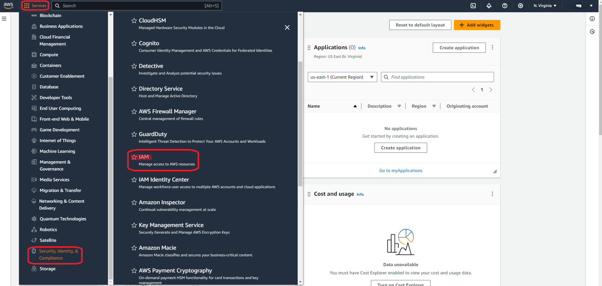
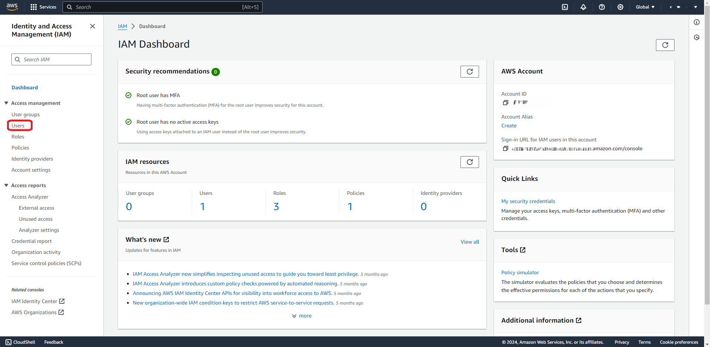
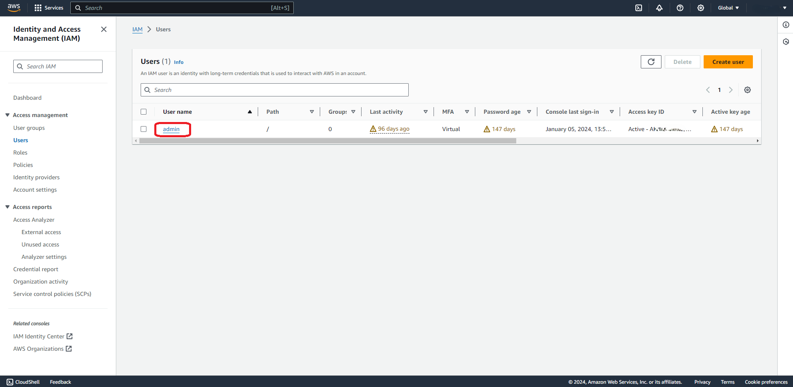
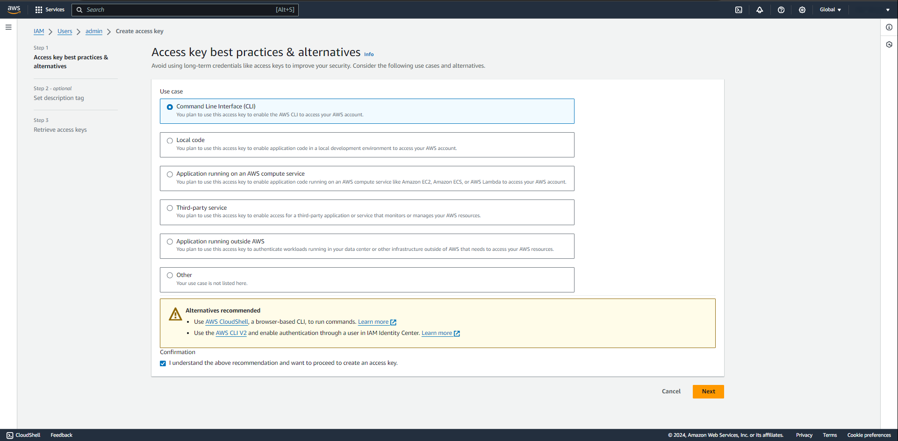
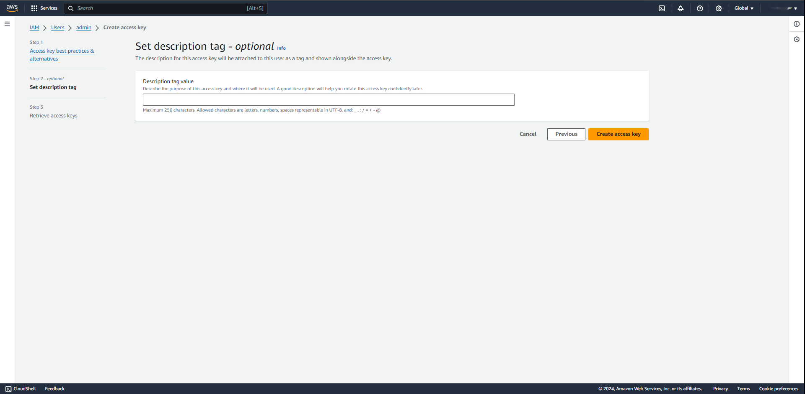
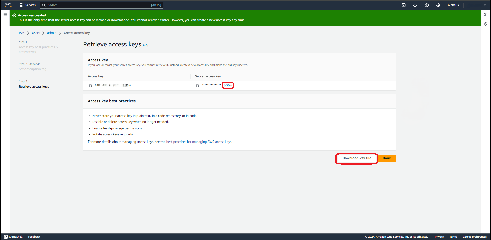

# Create API key to configure AWS CLI access
To Create access key and secret key using following instruction.
## 1. Select IAM Service from servies menu

## 2. Select Users Section from navigation menu

## 3. Select proper IAM user to generate API Key

## 4. Choose User Create Access Key
 
## 5. Select Access Key for Using CLI Access

## 6. Set Description for Genrated CLI Key

## 7. Show secret key and download it as csv file
